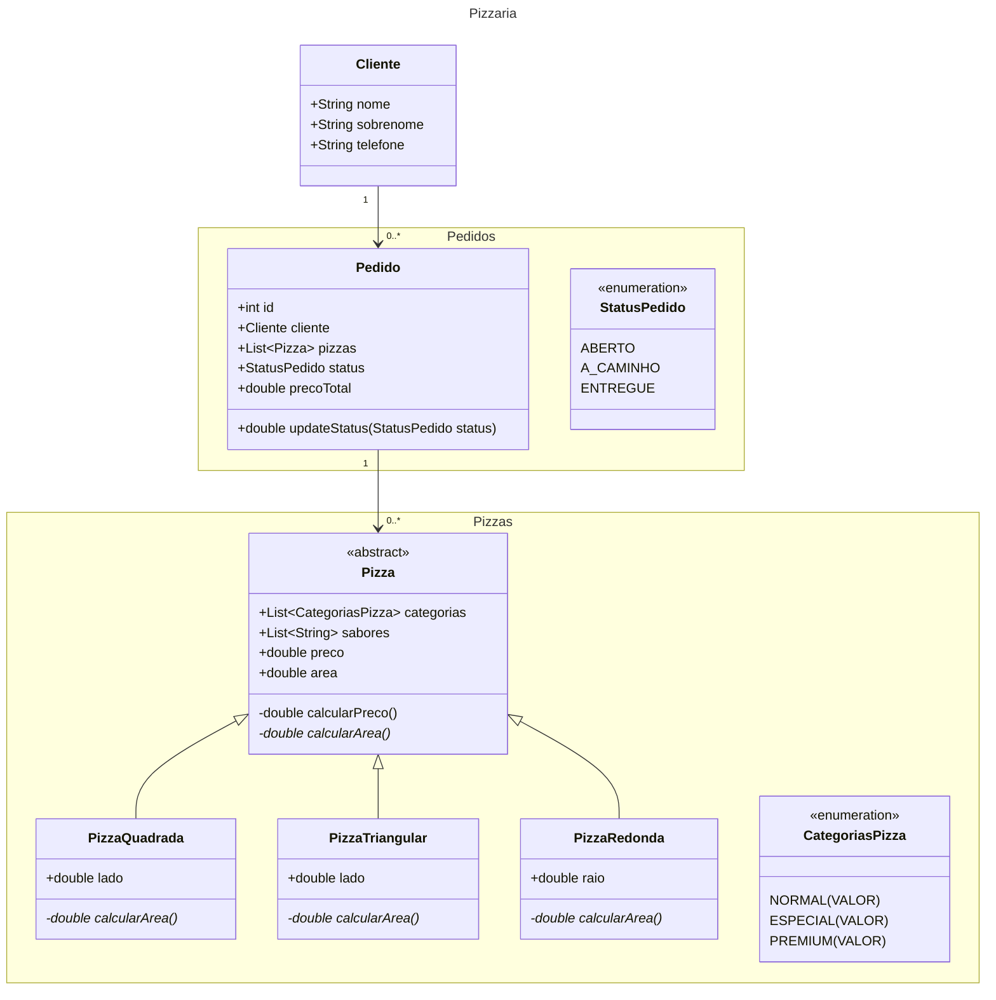

# Trabalho Final - Pizzaria

*Um empreendedor resolveu criar uma pizzaria diferente das que existem no mercado. A sua ideia é vender pizza em 
centímetro quadrado, no lugar das tradicionais pequena, média e grande. Além disso, também resolveu inovar na forma da 
pizza que pode assumir a forma tradicional circular, um quadrado, ou um triângulo. O preço de cada pizza será definido pela 
área em centímetros quadrados, cruzado com o tipo da pizza (dependendo dos ingredientes). Os sabores das pizzas estão 
divididos em Simples, Especial e Premium.*

*Para viabilizar o negócio ele contratou você para implementar um sistema de pedidos para esta pizzaria. O sistema terá os 
seguintes requisitos:*

1. **Uma tela para cadastro de clientes (Nome, SobreNome e Telefone)**
    - Nesta tela deve ser possível listar todos os clientes (Use a JTable)
    - Nesta tela deve ser possível atualizar os dados de um cliente existente
    - Nesta tela deve ser possível excluir um cliente (excluir também os pedidos que ele possui)
    - Listar os clientes com filtro pelo sobrenome, parte do sobrenome e/ou telefone

2. **Uma tela para realização do pedido das pizzas**
    - O cliente deve estar previamente cadastrado para realizar o pedido (tela anterior)
    - O usuário escolhe um cliente (O filtro do cliente deve ser por Telefone). Ao escolher o cliente, se o cliente já possuir pedido, os itens do pedido do cliente são listados e poderão ser atualizados. Se o cliente não possuir pedido, o usuário poderá adicionar itens ao pedido do cliente. Cada item corresponde a uma pizza.
    - O usuário escolhe:
        1. A forma da pizza
        2. As dimensões da forma (se for quadrado, o lado; se for circular, o raio; e se for triangular o lado do triângulo (que será equilátero))
            - O lado do quadrado deve ter no mínimo 10 e no máximo 40 cm.
            - O lado do triângulo deve ter no mínimo 20 e no máximo 60 cm.
            - O raio do círculo deve ter no mínimo 7 e no máximo 23 cm.
        3. O(s) sabor(es) da pizza (que está(ão) relacionado(s) ao tipo da pizza). (Até 2 sabores)
        4. Ou o usuário pode também informar a quantidade em centímetros quadrados. O sistema deve calcular e mostrar: O raio no caso de um círculo, o valor do lado (quadrado) ou o valor do lado do triângulo no caso do triângulo. Este valor deve ser: no mínimo de 100 cm² e no máximo de 1600 cm².
    - Durante o processo o sistema deve informar o preço total da venda.
    - O preço da pizza é calculado por centímetro quadrado, conforme o tipo da pizza (Simples, Especial e Premium). A mesma pizza pode ser dividida em sabores com dois tipos. Neste caso, o sistema deve calcular o preço da pizza fazendo a média aritmética dos dois tipos.
    - O sistema deve armazenar para cada pedido: As pizzas, um identificador para o pedido e o preço total do pedido.
    - O sistema deve fornecer o preço total da compra na tela de pedidos.
    - No mesmo pedido pode ser incluído mais de uma pizza.
    - O sistema deve permitir alterar o pedido.

3. **Uma tela para atualizar o preço do centímetro quadrado de cada tipo de pizza deve ser fornecida para o sistema.**

4. **Uma tela para cadastrar os sabores das pizzas e relacionar cada sabor ao tipo da pizza.**

5. **O pedido pode assumir 3 Statuss: aberto, a caminho e entregue. Deve existir uma tela para visualizar os pedidos de todos os clientes e seus Statuss. Nesta mesma tela o usuário pode alterar o Status dos pedidos.**

6. **Devem ser implementadas todas as validações nos campos das telas, informando ao usuário quando ele digita algum valor inválido.**

7. **Deve ser feito o tratamento qualificado das exceções.**

*O programa acima deve ser feito utilizando as seguintes tecnologias:*
- Utilizar herança para definir as classes Forma, Quadrado, Triângulo e Círculo
- Utilizar polimorfismo no cálculo da área da pizza.

---

## Diagrama de Classes

